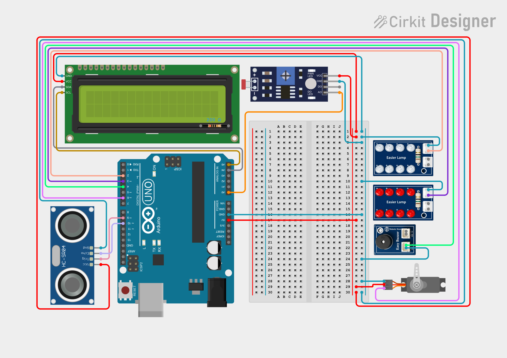

<div align="center">

# 📡 SonarShield
### Smart Sonar Radar & Safety Alert System

An Arduino Uno-based embedded radar platform that combines a servo-driven ultrasonic sweep, ambient light sensing, and a real-time Processing dashboard with full two-way (hardware ↔ software) control.

[](https://www.arduino.cc/)
[](https://processing.org/)
[](LICENSE)
[](#-course-information)
[](#)

[Overview](#-overview) •
[Features](#-features) •
[Hardware](#-hardware--components) •
[Circuit](#-circuit-diagram) •
[Getting Started](#-getting-started) •
[Serial Protocol](#-serial-communication-protocol) •
[Project Structure](#-repository-structure) •
[Team](#-team--credits)

</div>

---

## 📖 Overview

**SonarShield** continuously scans its surroundings with a servo-mounted HC-SR04 ultrasonic sensor, rendering a live radar sweep on a desktop GUI built in Processing. It simultaneously monitors ambient brightness with an LDR to auto-control a status LED, and raises an audible/visual alert whenever an object enters a defined proximity range — with buzzer mute and light-mode controls operable **directly from the GUI**, sent back to the Arduino over the same serial link.

Originally built as a laboratory project for the **Microprocessor and Interfacing Laboratory (ICE 3146)** course at **Daffodil International University**, the project demonstrates practical sensor interfacing, PWM servo control, I2C communication, and bidirectional serial protocol design on a single low-cost embedded platform.

## ✨ Features

- 🎯 **Live radar sweep** (15°–190°) with a fading afterglow trail and a red "detection wedge" for in-range objects
- 📏 **Ultrasonic distance sensing** via HC-SR04, streamed to the PC in real time
- 💡 **Adaptive lighting** — an LDR automatically turns a status LED on in the dark, with **AUTO / FORCED ON / FORCED OFF** modes selectable from the GUI
- 🔔 **Proximity alert** — Red LED turns on within 40 cm; buzzer sounds only within 15 cm
- 🔇 **Buzzer mute** toggle, controllable from the GUI without touching the hardware
- 🖥️ **Processing-based dashboard** — radar visualization, live angle/distance/light/buzzer status, all in one window
- 🔁 **Bidirectional serial link** — the GUI doesn't just display data, it sends commands back to the Arduino
- 🖨️ **Local LCD readout** (16×2 I2C) — the system stays readable even with no PC connected

## 🧩 Hardware & Components

| Component | Qty | Role |
|---|:---:|---|
| Arduino Uno R3 | 1 | Main microcontroller — runs all sensing and control logic |
| HC-SR04 Ultrasonic Sensor | 1 | Measures object distance (radar sensing) |
| SG90 Servo Motor | 1 | Rotates the ultrasonic sensor for the radar sweep |
| 16×2 I2C LCD Display | 1 | Shows live distance, light, and buzzer status locally |
| LDR Light Sensor Module | 1 | Detects ambient brightness / darkness |
| Status LED | 1 | Auto-ON in the dark, or manually forced via the GUI |
| Red LED | 1 | Steady ON whenever an object is within 40 cm |
| Active Buzzer Module | 1 | Sounds only when an object is within 15 cm; mutable from the GUI |
| Breadboard + Jumper Wires | — | Circuit assembly |
| 220 Ω Resistors | 2 | Current-limiting resistors for the LEDs |

> 💰 Total prototype cost ≈ **1,900 BDT**. Full cost breakdown and component sourcing notes are in [`docs/SonarShield_Project_Report.pdf`](docs/SonarShield_Project_Report.pdf).

## 🔌 Circuit Diagram

Designed and verified in **[Cirkit Designer](https://app.cirkitdesigner.com/)** before assembly.

<p align="center">
  
</p>

- 🖼️ Full-resolution raster: [`hardware/circuit_diagram.png`](hardware/circuit_diagram.png)
- 🧷 Editable vector source: [`hardware/circuit_diagram.svg`](hardware/circuit_diagram.svg)
- 🔗 **Live interactive project** on Cirkit Designer: [app.cirkitdesigner.com/project/fac6bf23-f269-4142-90b2-72c8f72bdcbb](https://app.cirkitdesigner.com/project/fac6bf23-f269-4142-90b2-72c8f72bdcbb)

<details>
<summary>Embed this circuit interactively in a blog or webpage</summary>

```html
<div style="position: relative; width: 100%; padding-top: calc(max(56.25%, 400px));">
  <iframe src="https://app.cirkitdesigner.com/project/fac6bf23-f269-4142-90b2-72c8f72bdcbb?view=interactive_preview" style="position: absolute; top: 0; left: 0; width: 100%; height: 100%; border: none;"></iframe>
</div>
<p style="margin-top: 5px;">Edit this project interactively in <a href="https://app.cirkitdesigner.com/project/fac6bf23-f269-4142-90b2-72c8f72bdcbb" target="_blank">Cirkit Designer</a>.</p>
```

</details>

### Pin Connections

| Peripheral | Arduino Pin(s) | Notes |
|---|---|---|
| HC-SR04 Trig / Echo | D9 / D10 | 5V & GND shared from Arduino power rails |
| Servo signal | D6 | PWM-capable pin required |
| Status LED (+220 Ω) | D2 | Auto ON in the dark, or forced via the GUI |
| Red LED (+220 Ω) | D3 | ON whenever an object is within 40 cm |
| Buzzer | D4 | ON only within 15 cm; mutable from the GUI |
| LDR | A0 | Voltage-divider circuit with a fixed resistor to GND |
| LCD (I2C) | A4 (SDA), A5 (SCL) | Address `0x27` |

## 🚀 Getting Started

### Prerequisites

| Tool | Used for |
|---|---|
| [Arduino IDE](https://www.arduino.cc/en/software) (1.8.x or 2.x) | Uploading the firmware |
| [Processing IDE](https://processing.org/download) (3.x or 4.x) | Running the desktop radar GUI |
| Arduino library: **Servo** | Bundled with the Arduino IDE |
| Arduino library: **Wire** | Bundled with the Arduino IDE |
| Arduino library: **LiquidCrystal_I2C** | Install via *Sketch → Include Library → Manage Libraries* |
| Processing library: **Serial** | Bundled with Processing |

### 1. Flash the firmware

```bash
# Open in Arduino IDE
firmware/SonarShield/SonarShield.ino
```
Wire the hardware as described in [Pin Connections](#pin-connections), select your board/port, then **Upload**.

### 2. Run the GUI

```bash
# Open in Processing IDE
gui/SonarShield_GUI/SonarShield_GUI.pde
```
Before running, update the serial port at the top of the sketch to match your Arduino:
```java
String COM_PORT = "COM6";  // change to your Arduino's port, e.g. "COM3" or "/dev/ttyUSB0"
```
Close the Arduino IDE's Serial Monitor first (only one program can hold the port at a time), then press **Run (▶)**.

### 3. Using the dashboard

| Control | Effect |
|---|---|
| **Mute / Unmute Buzzer** button | Sends `'M'` to the Arduino — silences the buzzer without stopping the radar scan |
| **Light Mode** button | Sends `'L'` — cycles the status LED through `AUTO → FORCED ON → FORCED OFF` |

## 📡 Serial Communication Protocol

The link between the Arduino and the GUI is fully bidirectional over USB-serial at **9600 baud**.

**Arduino → GUI** (sent continuously, one packet per servo step):
```
angle,distance,lightSensorDark,lightOn,lightMode,buzzerOn,muted.
```
Example: `76,24,1,1,0,0,0.`

| Field | Meaning |
|---|---|
| `angle` | Current servo angle (15°–190°) |
| `distance` | Distance in cm (`400` = out of range / no echo) |
| `lightSensorDark` | `1` = LDR reads dark, `0` = bright |
| `lightOn` | `1` = status LED is physically ON |
| `lightMode` | `0` = AUTO, `1` = FORCED ON, `2` = FORCED OFF |
| `buzzerOn` | `1` = buzzer is physically sounding |
| `muted` | `1` = buzzer manually muted by the user |

**GUI → Arduino** (single-character commands):

| Command | Effect |
|:---:|---|
| `M` / `m` | Toggle buzzer mute on/off |
| `L` / `l` | Cycle light mode: AUTO → FORCED ON → FORCED OFF → AUTO |

## 📂 Repository Structure

```
SonarShield/
├── README.md                              # You are here
├── LICENSE
├── firmware/
│   └── SonarShield/
│       └── SonarShield.ino                # Arduino firmware (radar, sensors, alerts, serial protocol)
├── gui/
│   └── SonarShield_GUI/
│       └── SonarShield_GUI.pde            # Processing dashboard (radar visualization + controls)
├── hardware/
│   ├── circuit_diagram.png                # Circuit diagram (raster)
│   └── circuit_diagram.svg                # Circuit diagram (vector / editable)
├── docs/
│   └── SonarShield_Project_Report.pdf     # Full lab report: purpose, cost breakdown,
│                                           # functionality, business proposal, challenges
└── media/                                 # Demo screenshots / photos (add your own here)
```

> 📝 Arduino and Processing both require the sketch file to live inside a folder of the **same name** — that convention is preserved here (`firmware/SonarShield/SonarShield.ino`, `gui/SonarShield_GUI/SonarShield_GUI.pde`), so both folders can be opened directly in their respective IDEs.

## 🧭 Roadmap / Future Scope

- Wireless telemetry (Wi-Fi / Bluetooth) to remove the wired USB dependency
- Mobile companion app for remote monitoring
- Higher-precision ranging (LiDAR-class sensor) for outdoor/industrial use
- Data logging and historical analytics on the dashboard
- Sturdier enclosure and custom PCB for a non-prototype build

See **Section 7 (Business Proposal)** and **Section 8 (Potential Challenges)** of the [project report](docs/SonarShield_Project_Report.pdf) for a fuller discussion.

## 🎓 Course Information

| | |
|---|---|
| **Course** | Microprocessor and Interfacing Laboratory (ICE 3146) |
| **Semester** | Summer 2026, Level-Term L2-T3, Section A2 |
| **Department** | Information and Communication Engineering (ICE), Daffodil International University |
| **Submitted to** | Sameer Khairul, Lecturer, Dept. of ICE, DIU |

## 👥 Team & Credits

**Group No. 1 — ICE Department, DIU**

| Name | Student ID |
|---|---|
| Nazmul Ahmed Fahim | 242-50-040 |
| Mst. Amena Khatun | 242-50-048 |
| Fatin Ishrak | 242-50-053 |
| Tasnim Imam Fema | 242-50-054 |
| Jannatul Mawoa | 242-50-055 |
| Md. Abdulla Hasan | 242-50-058 |
| Zaffar Abdullah | 242-50-059 |
| Md. Junayed Ahmed | 242-50-060 |

Circuit designed in [Cirkit Designer](https://app.cirkitdesigner.com/).

## 📄 License

Released under the [MIT License](LICENSE) — free to use, modify, and build upon for academic or personal projects, with attribution.

---

<div align="center">
<sub>Built with 🔧 and ☕ at the Dept. of ICE, Daffodil International University</sub>
</div>
